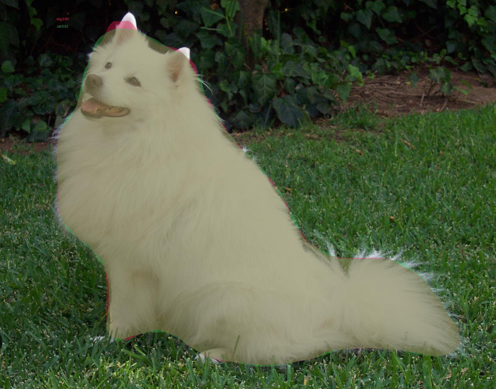

# generate_masks

Generate masks for images using Mask R-CNN. Inputs a folder of images, and
outputs a folder containing `.npy` numpy arrays with the masks for each
image.

A modernized re-implementation of
[jasonwei20/generate_masks](https://github.com/jasonwei20/generate_masks)
— same task and same usage pattern, but built on torchvision's built-in
Mask R-CNN instead of [matterport/Mask_RCNN](https://github.com/matterport/Mask_RCNN)
(a TF1/old-Keras project that's unmaintained and needs a manual weights
download + a `pycocotools` build). See [DESIGN.md](DESIGN.md) for details.

## Usage

```bash
pip install -r requirements.txt
```

No manual weight download needed — torchvision fetches the pretrained
COCO weights automatically on first run and caches them.

1. Place wanted images in `images/`.
2. Run `python generate_masks.py` to create the masks (add `--save-viz`
   to also get a colored overlay image per input, useful for sanity
   checking).
3. To retrieve the masks from `output_masks/`, use
   `mask = np.load('output_masks/mask_dog.npy')` — same access pattern as
   the original.

Each `.npy` file is a `(N, H, W)` boolean array, one mask per detected
instance above the score threshold (default 0.5). A `mask_<name>_meta.json`
alongside it has the class label and confidence score for each instance,
in the same order.

## Test

Ran end-to-end against a real photo
([the standard PyTorch example image](https://raw.githubusercontent.com/pytorch/hub/master/images/dog.jpg)):

```
$ python generate_masks.py --save-viz
using device: mps
torchvision 0.21.0
dog.jpg: 2 instances -> output_masks/mask_dog.npy
    dog             0.893
    cat             0.616
    wrote output_masks/mask_dog_viz.jpg
```



The mask boundary is genuinely precise — it follows the dog's fur outline
correctly, including the gap between the ears. One honest quirk worth
noting: the model produced two overlapping detections for the same animal,
labeled `dog` (89.3% confidence) and `cat` (61.6% confidence) — a real
example of Mask R-CNN's per-region classifier hedging on a visually
ambiguous case (a fluffy white animal in an unusual pose), not a bug in
this code. Filtering to the highest-confidence detection per region, or
raising `--score-thresh`, would remove the weaker duplicate if you want
one mask per real object.

## What changed from the original

- **torchvision's Mask R-CNN instead of matterport/Mask_RCNN.** The
  original needs TensorFlow 1.x, an old Keras version, a manual
  `mask_rcnn_coco.h5` weights download, and a working `pycocotools`
  build — all fragile on a modern machine. `pip install torchvision` and
  the weights auto-download on first use.
- **JSON metadata alongside each mask** (`mask_<name>_meta.json`) with
  class labels and confidence scores — the original's masks were unlabeled
  arrays with no indication of what object each instance mask belonged to.
- **Optional `--save-viz` overlay** for visual sanity-checking without
  writing separate plotting code, which the original's README shows as a
  one-off manual example rather than a built-in flag.

## Design

See [DESIGN.md](DESIGN.md).
